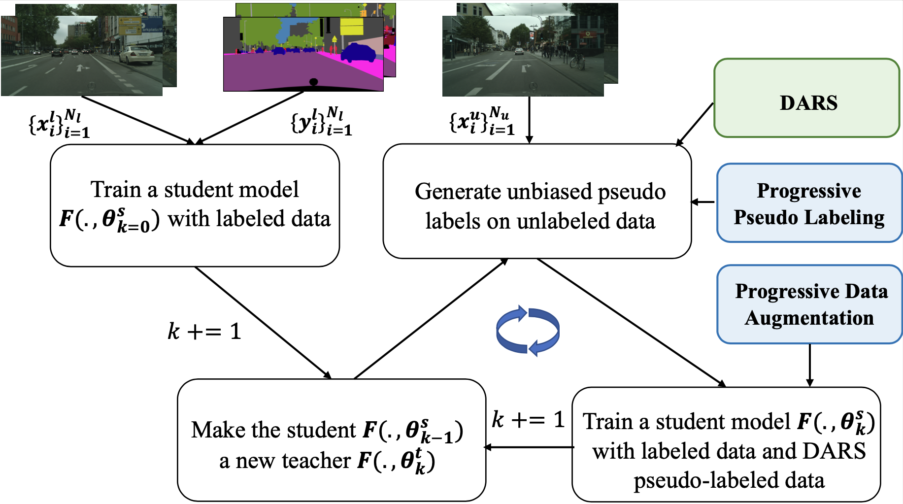

# DARS

Code release for the paper "Re-distributing Biased Pseudo Labels for Semi-supervised Semantic Segmentation: A Baseline Investigation", ICCV 2021 (oral).



**Authors**: Ruifei He\*,  Jihan Yang\*,  Xiaojuan Qi (\*equal contribution)

[arxiv](https://arxiv.org/abs/2107.11279)


## Usage

### Install

- Clone this repo:

```
git clone https://https://github.com/CVMI-Lab/DARS.git
cd DARS
```

- Create a conda virtual environment and activate it:

```
conda create -n DARS python=3.7 -y
conda activate DARS
```

- Install `CUDA==10.1` with `cudnn7` following the [official installation instructions](https://docs.nvidia.com/cuda/cuda-installation-guide-linux/index.html)
- Install `PyTorch==1.7.1` and `torchvision==0.8.2` with `CUDA==10.1`:

```
conda install pytorch==1.7.1 torchvision==0.8.2 cudatoolkit=10.1 -c pytorch
```

- Install `Apex`:

```
git clone https://github.com/NVIDIA/apex
cd apex
pip install -v --disable-pip-version-check --no-cache-dir --global-option="--cpp_ext" --global-option="--cuda_ext" ./
```

- Install other requirements:

```
pip install opencv-python==4.4.0.46 tensorboardX pyyaml
```


### Initialization weights

For PSPNet50, we follow [PyTorch Semantic Segmentation](https://github.com/hszhao/semseg) and use Imagenet pre-trained weights, which could be found [here](https://drive.google.com/drive/folders/1Hrz1wOxOZm4nIIS7UMJeL79AQrdvpj6v). 

For Deeplabv2, we follow the exact same settings in [semis-semseg](https://github.com/sud0301/semisup-semseg), [AdvSemiSeg](https://github.com/hfslyc/AdvSemiSeg) and use [Imagenet pre-trained weights](https://download.pytorch.org/models/resnet101-5d3b4d8f.pth).

```
mkdir initmodel  
# Put the initialization weights under this folder. 
# You can check model/pspnet.py or model/deeplabv2.py.
```


### Data preparation

```
mkdir dataset  # put the datasets under this folder. You can verify the data path in config files.
```

#### Cityscapes

Download the dataset from the Cityscapes dataset server([Link](https://www.cityscapes-dataset.com/)). Download the files named 'gtFine_trainvaltest.zip', 'leftImg8bit_trainvaltest.zip' and extract in `dataset/cityscapes/`.

For data split, we randomly split the 2975 training samples into 1/8, 7/8 and 1/4 and 3/4. The generated lists are provided in the `data_split` folder.

Note that since we define an epoch as going through all the samples in the unlabeled data and a batch consists of half labeled and half unlabeled, we repeat the shorter list (labeled list) to the length of the corresponding unlabeled list for convenience. 

You can generate random split lists by yourself or use the ones that we provided. You should put them under `dataset/cityscapes/list/`.

#### PASCAL VOC 2012

The PASCAL VOC 2012 dataset we used is the commonly used 10582 training set version. If you are unfamiliar with it, please refer to this [blog](https://www.sun11.me/blog/2018/how-to-use-10582-trainaug-images-on-DeeplabV3-code/).

For data split, we use the official 1464 training images as labeled data and the 9k augmented set as unlabeled data. We also repeat the labeled list to match that of the unlabeled list.

You should also put the lists under `dataset/voc2012/list/`.


### Training

The config files are located within `config` folder.

<<<<<<< HEAD
For PSPNet50, crop size 713 requires at least 4*16G GPUs or 8\*10G GPUs, and crop size 361 requires at least 1\*16G GPU or 2\*10G GPUs. 

For Deeplabv2, crop size 361 requires at least 1\*16G GPU or 2\*10G GPUs.
=======
 For PSPNet50, crop size 713 requires at least 4*16G GPUs or 8\*10G GPUs, and crop size 361 requires at least 1\*16G GPU or 2\*10G GPUs. Please adjust the GPU settings in the config files ('train_gpu' and 'test_gpu') according to your machine setup.
>>>>>>> 43075ce5fd3c1c92d4b285112b2e49884638d96a

The generation of pseudo labels would require 200G usage of disk space, reducing to only 600M after they are generated.

All training scripts for pspnet50 and deeplabv2 are in the `tool/scripts` folder. For example, to train PSPNet50 for the Cityscapes 1/8 split setting with crop size 713x713, use the following command:

```
sh tool/scripts/train_psp50_cityscapes_split8_crop713.sh
```


## Acknowledgement

Our code is largely based on [PyTorch Semantic Segmentation](https://github.com/hszhao/semseg), and we thank the authors for their wonderful implementation.

We also thank the open-source code from [semis-semseg](https://github.com/sud0301/semisup-semseg), [AdvSemiSeg](https://github.com/hfslyc/AdvSemiSeg), [DST-CBC](https://github.com/voldemortX/DST-CBC/).


## Citation

If you find this project useful in your research, please consider cite:

```
@inproceedings{he2021re,
  title={Re-distributing Biased Pseudo Labels for Semi-supervised Semantic Segmentation: A Baseline Investigation},
  author={He, Ruifei and Yang, Jihan and Qi, Xiaojuan},
  booktitle={Proceedings of the IEEE International Conference on Computer Vision (ICCV)},
  year={2021}
}
```


